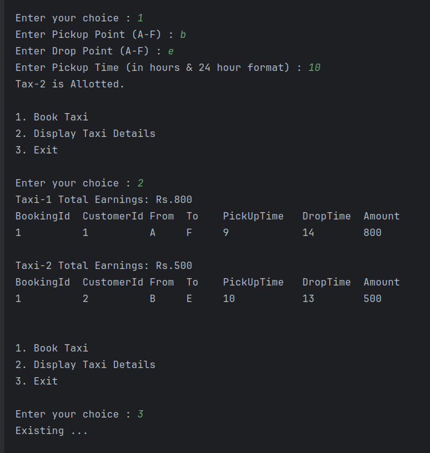

# 🚖 Taxi Booking Console Application (Java)

This is a simple Java console-based Taxi Booking application where users can book rides, and the nearest available taxi is assigned based on location and time.

## 📸 Screenshots

### 1. App Start Screen

### 2. Booking Process

### 3. Booking Summary

## 📦 Features

- Book a taxi with pickup and drop location
- Assigns nearest available taxi
- Displays ride history
- Simple text-based UI

## 🛠 Technologies Used

- Java (Core)
- OOP Concepts
- Console UI

## 🚀 How to Run

1. Clone the repo: git clone https://github.com/imsaravanan7/TaxiBookingSystem
